# NUMAD22FaTeam26 -- Yummy China

 
  
  

## When you open the app first time:
  > An easy user log-in system would pop up.
  > 
  > Once log-in, you would be guided by onboarding flash cards. 

    
   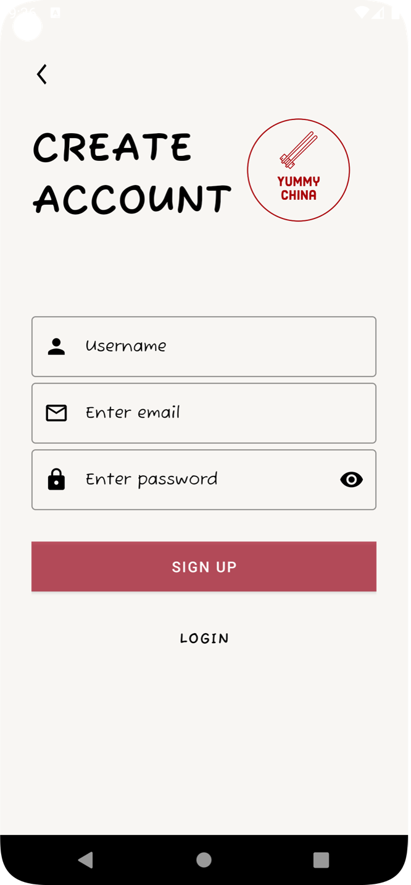
   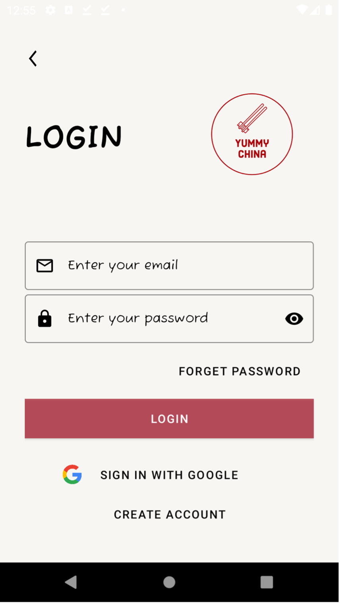 
   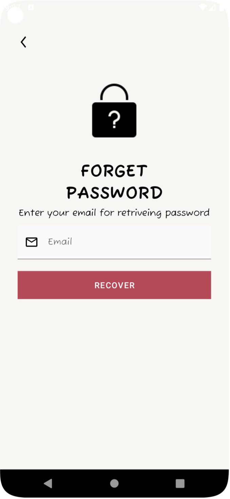 
   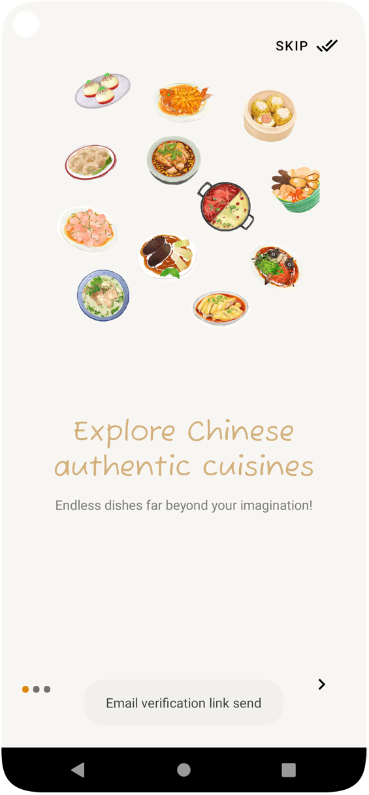
   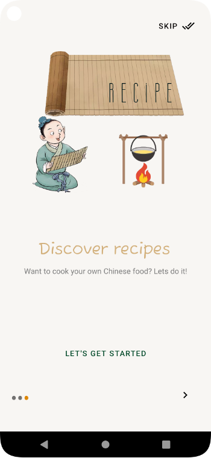 
   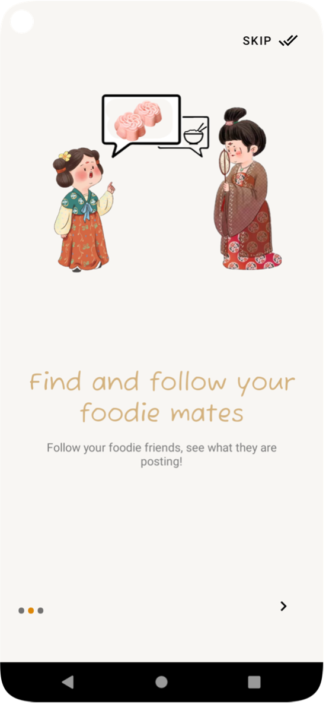 

## On the home page:

 >  View different posts:  posts from friends that you have followed [follow], posts that you have liked [likes], or posts from your beloved themes [for you]
 >  
 > Post "short stories" by clicking the "+" bottom on the upper left, and view friends' "stories" by clicking the following circles.
 > 
 > Click a post to view details & comment of the post. Like, comment or share a post using the following buttons!
 >
 > Click the envenlope on the uper right to view messages.
  

    
   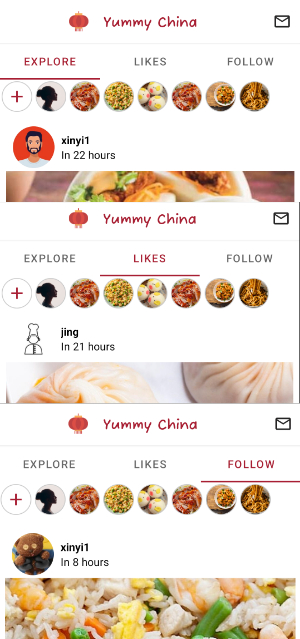
   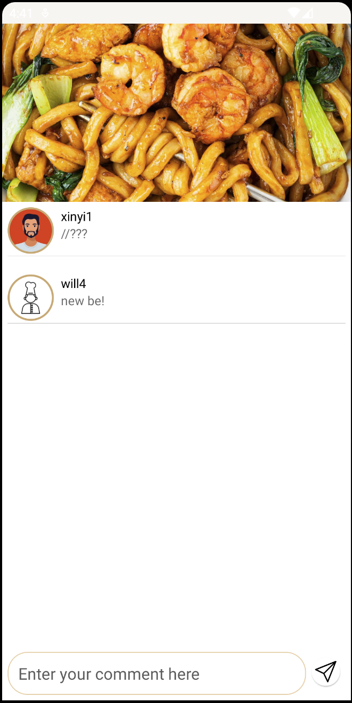 
   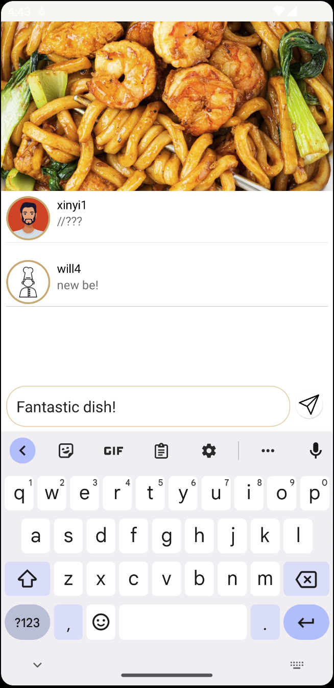 
   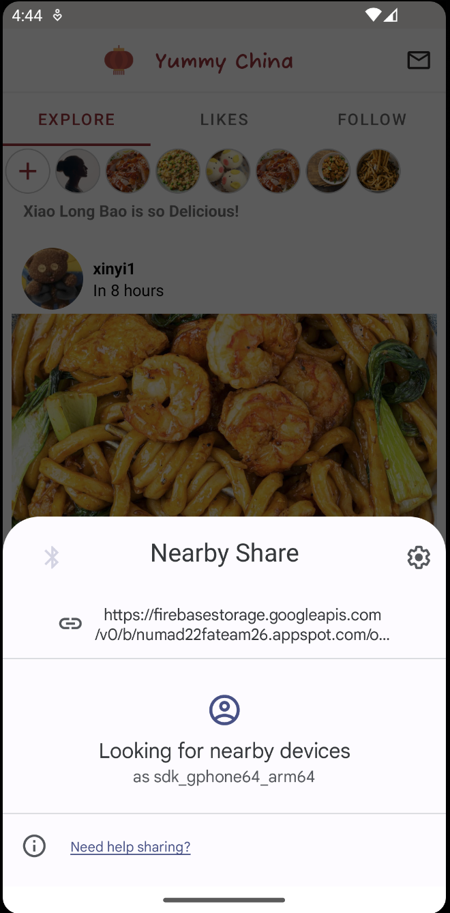
    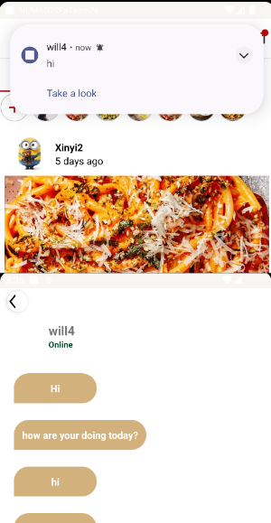

## On the search page:
 > Find someone you are interested in, view their profile, follow them and chat with them!
 > 
 > Check if you friends are online or not here
  

    
   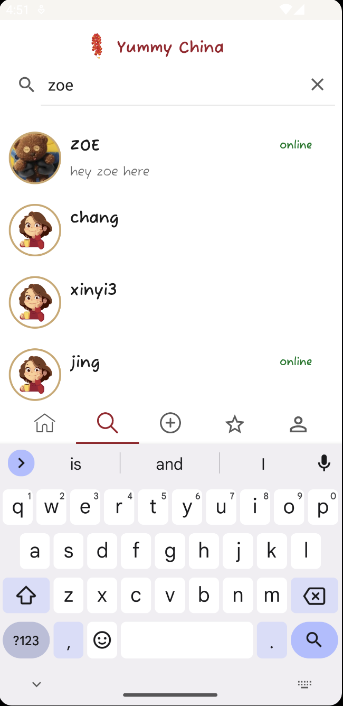
   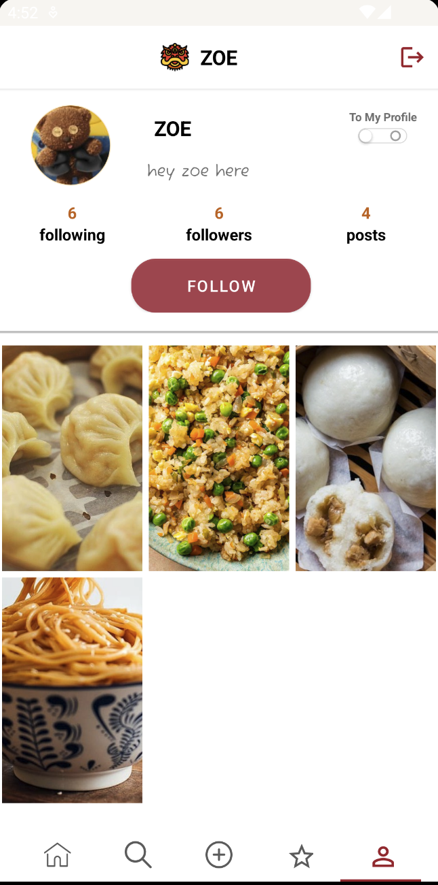 
   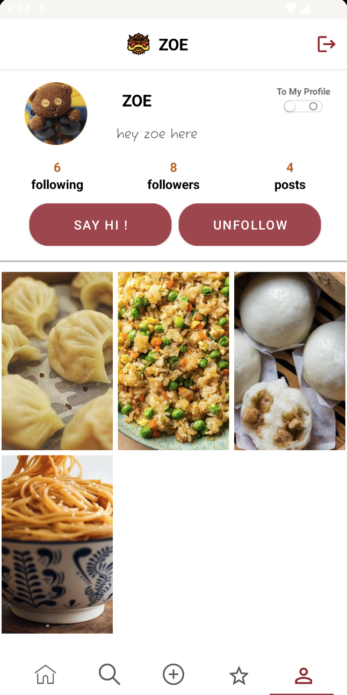 
   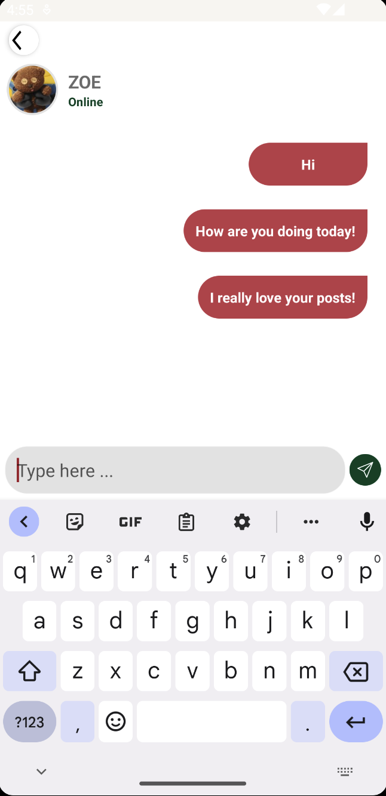

## On the post page:

> Choose the picture you like from your storage and make a post! all your followers would see it immediately so don't forget to say something!

    
   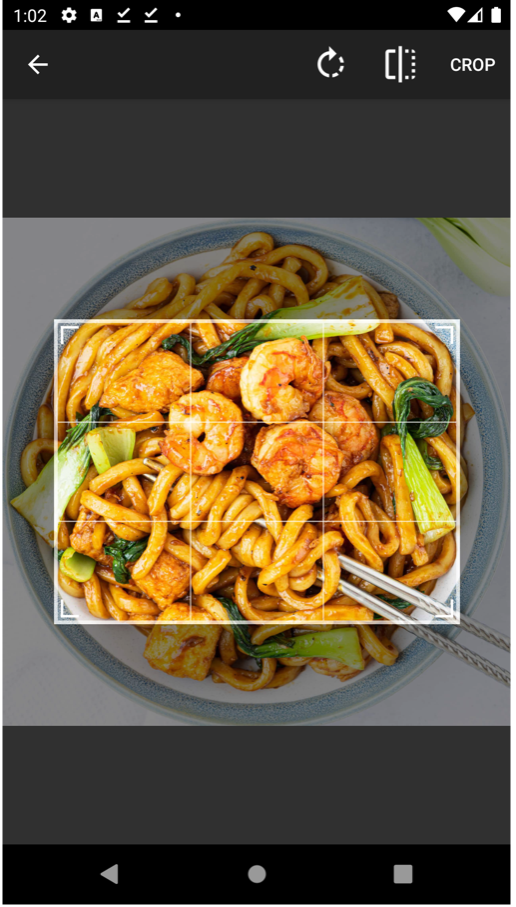
   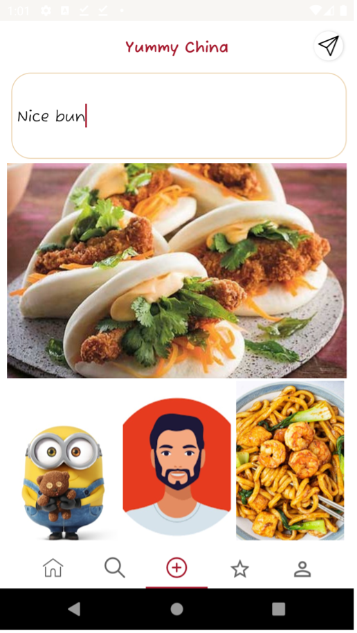 
    
   

## On the recipe page:
 > An editor's recomment dish would be present here to blow your mind！
 > 
 > Detailed recipe would be provided by editors to help you cook your perfect dinner!
 > 
 > And posts which are relevant to this topic would be presented to give you more imformation!

    
   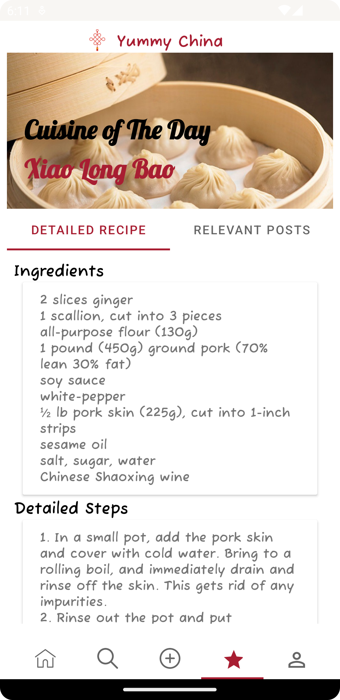
   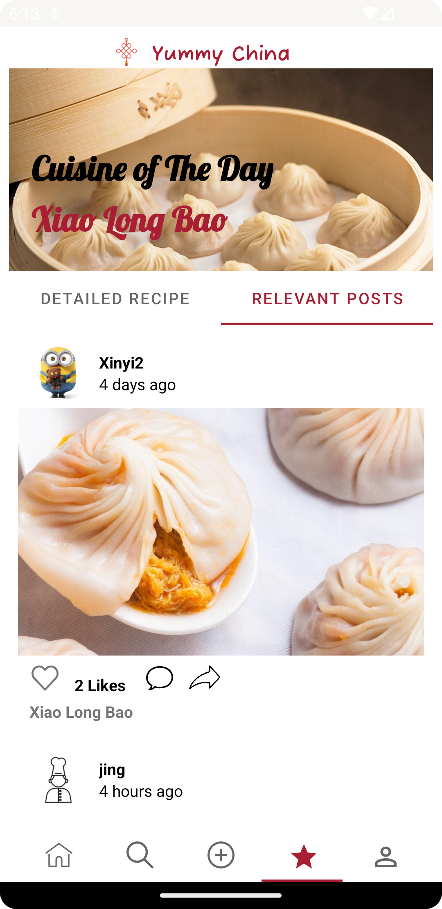 

 
## On the profile page:
> Manage your profile, see how many followers/followees you have, and chat with your friends!
> 
> Quit or switch to another account here。

    
   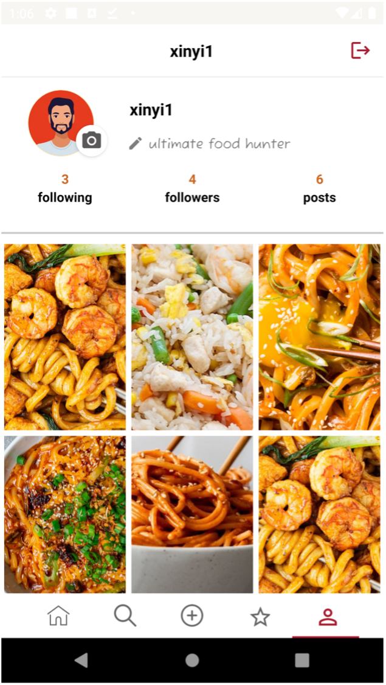
   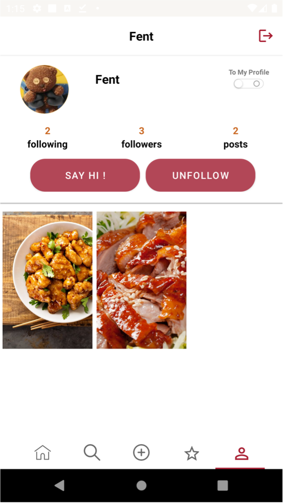 

***
***

## About Team
#### Team Leader

:star:  **Xinyi Feng** : [FentPams](https://github.com/FentPams) 

#### Team Members

:man_technologist:     **Jason Zhang** : [HaozheZhang0818](https://github.com/HaozheZhang0818)/
:woman_technologist:   **Jing Ye** : [yej002](https://github.com/yej002)/
:man_technologist:     **Mozhi Shen** : [Mozhi21](https://github.com/Mozhi21)

